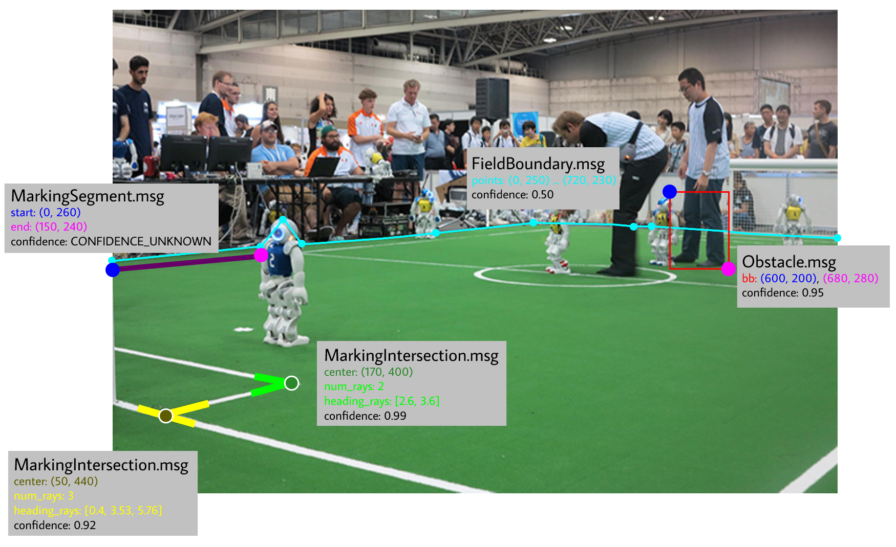

# soccer_vision_2d_msgs

This package provides 2d messages for visually detected objects on a soccer field, such as balls, field lines and robots.

## Messages (.msg)

* Ball
* BallArray
* FieldBoundary
* Goalpost
* GoalpostArray
* MarkingEllipse
* MarkingIntersection
* MarkingSegment
* MarkingArray
* Obstacle
* ObstacleArray
* Robot
* RobotArray 

## Examples

